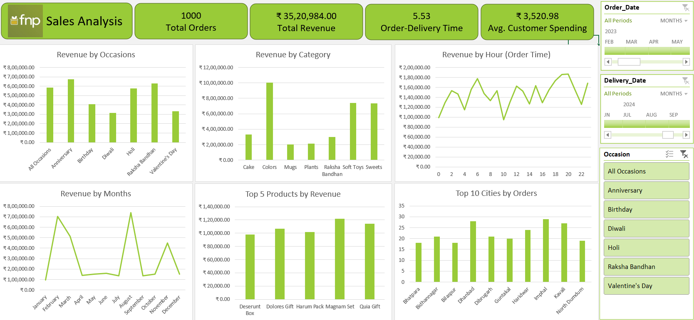

# FNP Sales Data Analysis Dashboard

## Dashboard Preview

---

## Project Overview

This project performs structured exploratory data analysis (EDA) on transactional sales data from Ferns N Petals (FNP). The objective was to transform raw order-level data into measurable business insights using KPI development, trend analysis, and interactive dashboard visualization in Microsoft Excel.

The project focuses on revenue analysis, seasonality detection, product performance evaluation, geographic demand analysis, and delivery efficiency assessment.

---

## Analytical Objectives

- Quantify overall revenue and order performance  
- Measure operational efficiency through delivery timelines  
- Identify monthly and seasonal sales trends  
- Determine top-performing products and categories  
- Analyze customer spending behavior  
- Evaluate city-level demand concentration  
- Assess relationship between order quantity and delivery time  

---

## Data Preparation

- Cleaned inconsistent and missing values  
- Standardized date formats for time-series analysis  
- Created calculated fields:
  - Total Revenue  
  - Delivery Duration (Delivery Date − Order Date)  
  - Average Order Value  
- Validated numerical fields and removed duplicates  

---

## Exploratory Data Analysis (EDA)

- Aggregated revenue by month to identify seasonality  
- Segmented revenue by occasion and product category  
- Ranked products by total revenue contribution  
- Analyzed top 10 cities by order volume  
- Evaluated correlation between order quantity and delivery duration  
- Compared revenue performance across different occasions  

---

## Key Performance Indicators

| Metric | Value |
|--------|--------|
| Total Orders | 1,000 |
| Total Revenue | ₹35,20,984 |
| Average Order-Delivery Time | 5.53 Days |
| Average Customer Spending | ₹3,520.98 |

---

## Key Findings

- Revenue exhibits strong seasonal patterns with peak months aligned to major gifting occasions.  
- A small subset of products contributes disproportionately to total revenue.  
- Geographic demand is concentrated in specific high-performing cities.  
- Delivery timelines remain consistent across varying order quantities, indicating operational stability.  

---

## Tools and Techniques

- Microsoft Excel  
- Pivot Tables and Aggregations  
- Time-Series Analysis  
- KPI Development  
- Ranking and Segmentation Analysis  
- Interactive Dashboard Design  

---

## Skills Demonstrated

- Data Cleaning and Validation  
- Exploratory Data Analysis (EDA)  
- Business Insight Generation  
- KPI Design and Interpretation  
- Data Visualization  
- Analytical Thinking and Structured Problem Solving  

---

## Conclusion

This project demonstrates the ability to translate raw transactional data into actionable business insights. It reflects core Data Analyst competencies including structured analysis, performance monitoring, trend identification, and decision-support dashboard development.
